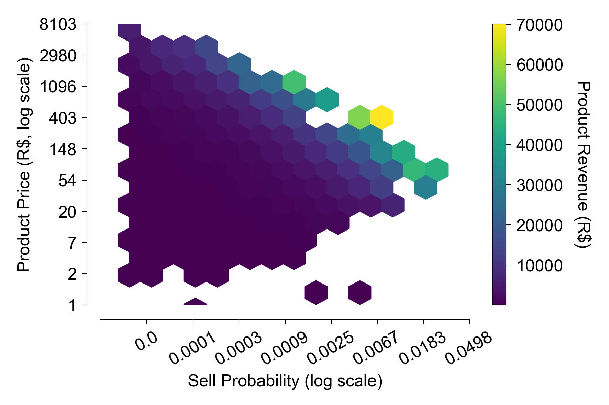
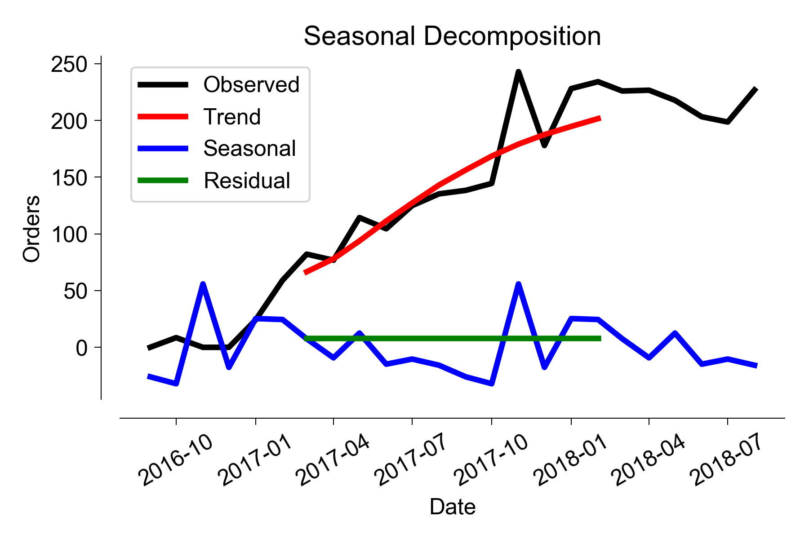
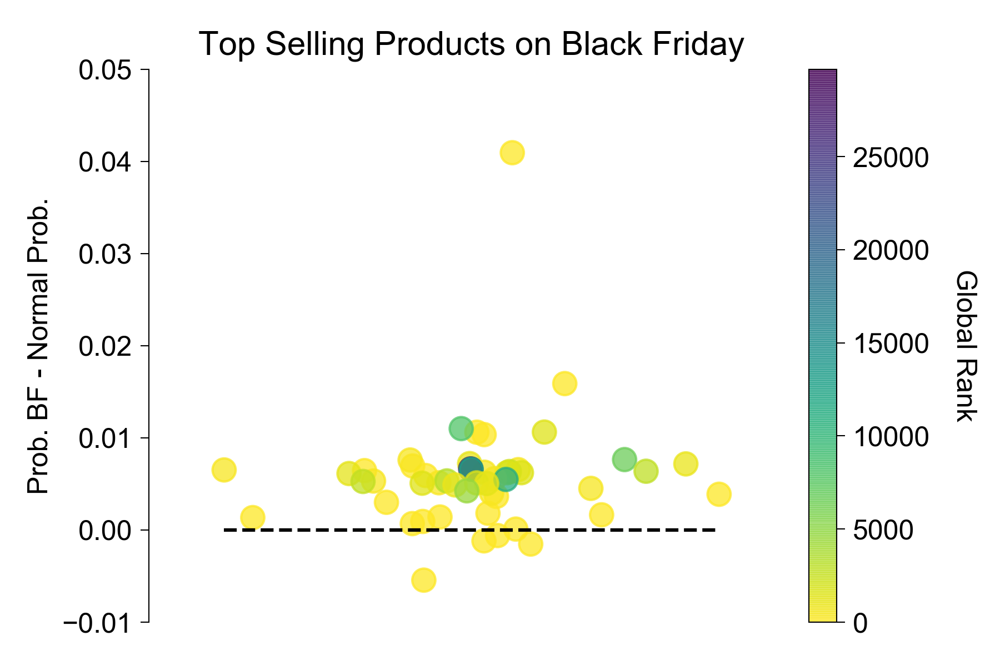
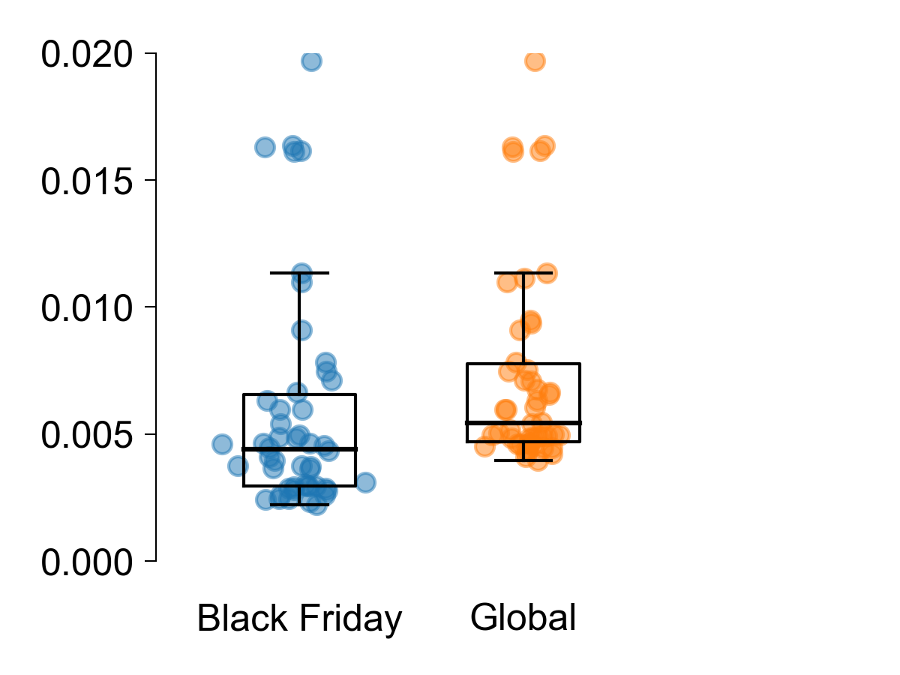
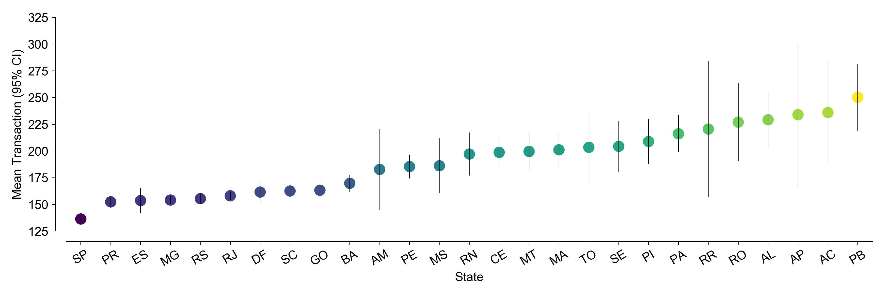
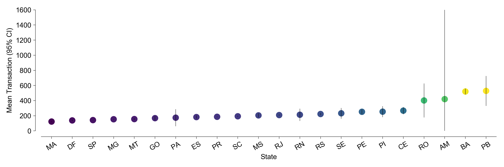

# Brazilian E-Commerce Statistical Analysis
*Ricardo Zacarias*

# Contents

[Project Abstract](#Project Abstract)

[Dataset](#Dataset)

[Questions](#Questions)

[Product Profiles](#Product Profiles)

[Do orders vary throughout the year?](#Do orders vary throughout the year?)

[Black Friday](#Black Friday)

[Customer Profiles](#Customer Profiles)

[Seller Profiles](#Seller Profiles)

[Conclusions](#Conclusions)

[References](#References)

# Project Abstract

This project features the commercial profile of products, customers and sellers that participate in the largest department store in Brazilian marketplaces. Calculated the frequency and price range of products that generate the most revenue. Used a seasonal decomposition model to extract seasonality and overall trends in the number of orders over time. Detected a peak in sales that coincide with *Black Friday* and found that the products most sold on promotional days are similar to those who already sell well. We also used latitude/longitude coordinates to geolocate the customers that spend the most and the highest volume sellers. 

TODO: Recency-Frequency-Monetary Value analysis which helps to identify the most valuable customers.

# Dataset
This is a well known dataset available from [Kaggle](https://www.kaggle.com/olistbr/brazilian-ecommerce). The dataset has information of 100k orders from 2016 to 2018 made at multiple marketplaces in Brazil. Its features allows viewing an order from multiple dimensions: from order status, price, payment and freight performance to customer location, product attributes and finally reviews written by customers. The dataset was generously provided [Olist](https://olist.com/), the largest department store in Brazilian marketplaces. Olist connects small businesses from all over Brazil to channels without hassle and with a single contract. Those merchants are able to sell their products through the Olist Store and ship them directly to the customers using Olist logistics partners.

### Important notes about the data

- An order might have multiple items.
- Each item might be fulfilled by a distinct seller.
- All text identifying stores and partners where replaced by the names of Game of Thrones great houses.

### Schema

The full dataset is divided in 8 files: orders, *payments, reviews, items, products, sellers, customers, geolocation*. Descriptions of the columns can be found on the the Kaggle link above, or on the main script.

# Questions

- Which product sells the most? Do they profit more from cheap or from expensive products?
- Do orders vary throughout the year?
- How much does the average customer spend? Does it vary with geographical location? 
- How much does the average shop sell? Does it vary with geographical location?

# Product Profiles

The products dataset shows that **32951** products were sold in 100k orders. Are there products that sell more than others? Or were they all sold approximately 3 times?

## Which products sell best?

We calculated the probability of each product being sold and show it here in a 2d-hexbin histogram together with price. The colors of each bin are determined by the **average revenue** generated by the products in each bin.

This tells us that the products that the products that sell more are mid-range items (between 50-500 R$).

## Which products generate more revenue?

To calculate what kind of products generate the most revenue in total, we repeated the same analysis but now the colors indicate the **total sum of revenue** of the products in the bins.

Olist makes more money not by selling a few products a lot, but **by selling a lot of different products each of them with low probability and in the range of 50-500 R$.**

# Do orders vary throughout the year?

Sales are a very dynamic process and usually have have some variation throughout the year.  Does Olist sell more during a specific time of the year? We calculated the number of orders per day in the 2-year period included in the dataset.

We observe that orders have increased gradually over time and that there's a spike in orders which coincides with **Black Friday** but more on that later. 

## Seasonal Decomposition

In order to separate the series in temporal components we performed a **seasonal decomposition analysis**. A given time series is thought to consist of three systematic components including level, trend, seasonality, and one non-systematic component called noise. These components are defined as follows:

- **Level**: the average value in the series.
- **Trend**: the increasing or decreasing value in the series.
- **Seasonality**: the repeating short-term cycle in the series.
- **Noise**: the random variation in the series.

We observe that **seasonal decomposition identified a significant upward trend** in the overall number of orders.  The seasonal component reveals the Black Friday spike but its averaging generates an artifact in the previous year where there was no spike. There's an additional seasonal bump in the months of Jan-Feb. We can also see that the residual plot shows zero. This is an indication that the decomposition model was not able to separate the noise. Caution and healthy skepticism are needed when using automated decomposition methods. 

# Black Friday

[][1]

There's a big spike of orders that happen during Black Friday (BF). While stores usually have sizable discounts on that day, the prices on this dataset are fixed.

## Which products were most sold during BF?

Next we wondered whether items sold on BF followed their normal selling probability or perhaps they sold more items that usually don't sell frequently.

For the **top 50 items sold on BF we calculated its selling probability and compared it to the rest of the days** on the dataset. Each product is also color-coded for its global selling rank on the product list.

We can see that **most products in the top 50 see their probability of selling increase during BF**. Also, the color codes reveal that the **top products on BF are those who rank high** (usually sell well). To confirm that, we compared the average probability of selling for the top 50 products and top 50 during BF.

With this sample, **we could not reject the hypothesis that the means between these groups are equal** (p = 0.16).

# Customer profiles

We calculated the average money spent per order and a 95% confidence interval for customers in each region in Brazil to estimate the population mean in every state.

We also visualized this distribution by plotting the average money spent per customer on a state-delimited map of Brazil.

# Seller profiles

We repeated the same analysis used for customer on all the sellers available in the dataset.

I also visualized this distribution by plotting the average order value by seller on a state-delimited map of Brazil.

# Conclusions

- Olist makes more money not by selling a few products a lot, but **by selling a lot of different products each of them with low probability and in the range of 50-500 R$.**
- We observe that **seasonal decomposition identified a significant upward trend** in the overall number of orders.
- **Most products in the top 50 see their probability of selling increase during BF**. The **top products on BF are those who rank high** (usually sell well).
- Paraíba (PB) is the highest ranked region by average transaction value for both customers and sellers. São Paulo (SP), for example lies on the other end of the same spectrum.

# References

[1]: https://machinelearningmastery.com/decompose-time-series-data-trend-seasonality/